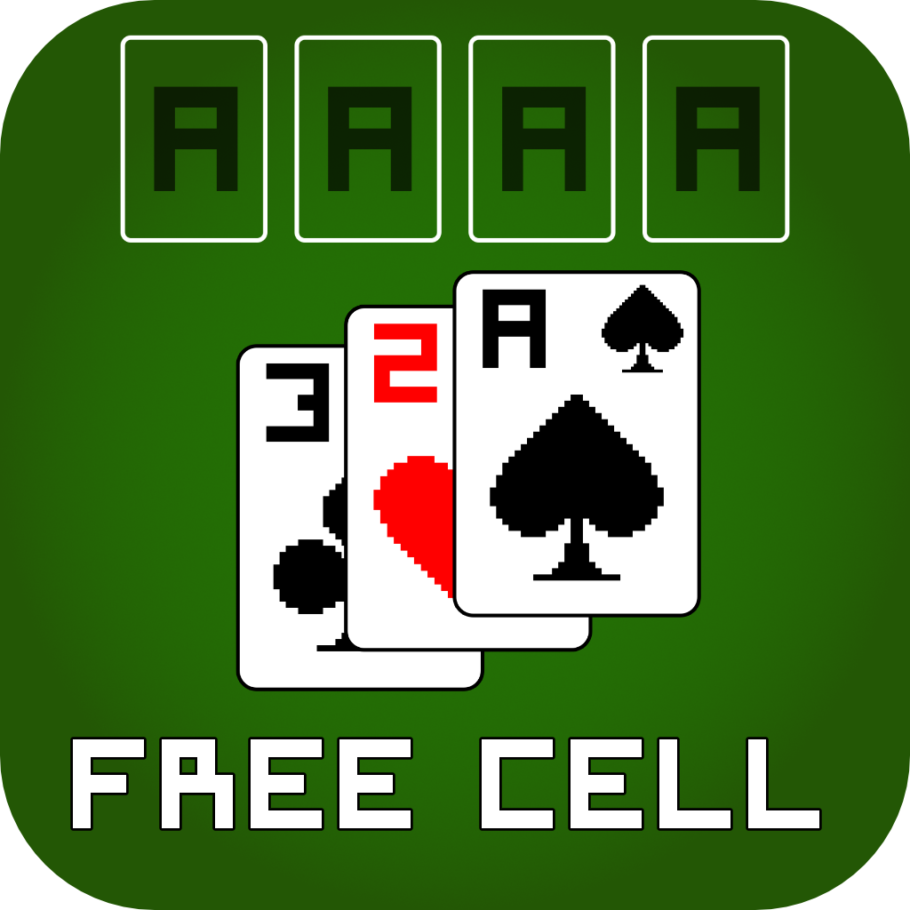

# FreeCell
The game FreeCell implemented with Godot!

GitHub: [FreeCellGodot](https://github.com/rawii22/FreeCellGodot)

Ricardo Romanach 2023

## Implementation

For the sake of keeping things as generic as possible, each area (columns, free cells, foundation slots) has these 4 functions:

- `add_card`
	- Receives a list of cards. Returns nothing. Places the card(s) in the list into the respective area.
- `remove_card`
	- Receives a single card object. Returns a list of cards. For columns, a list of all cards under the specified card, if any, will be returned. For the other two areas, an array with the single specified card will be returned. This function, as opposed to get_card_stack, will actually change internal properties of the parent area.
- `get_card_stack`
	- Receives a single card object. Returns a list of cards. It does the same thing as remove_card, however nothing internally would be changed. This is used as a what-if function when card.gd is checking if a stack of cards can be dragged or not.
- `can_place_card`
	- Received a list of cards. Returns a boolean. If the card(s) in the list can be placed in the respective area, it will return true.

## Features
- **Right clicking on a card** will automatically move it to another location. It will attempt to move to another location in this order: foundation, occupied columns, open columns, free cells. If none of these locations are available, it will not move.
- By **right clicking anywhere on the table**, the game will look for any card that can be moved to the foundation and, if possible, move it to the foundation automatically.
- **Auto-complete**: Once the game detects that you have won, it will offer the option to auto complete. If you reject auto-complete, you can always trigger it again by clicking on the check button on the left of the play area.
- **Numbered Deals**: By opening the menu, you can specify the desired deal number in the "New Game" button. Hit enter or click on the button after typing in the number (0-9999999) and the respective deal will be drawn. You can also click on the little "?" button to have a random number selected for you.
	- The limit for an integer in Godot is -9223372036854775808 to 9223372036854775807 (signed 64 bits). I chose 9999999 arbitrarily, but partially because it looked pretty and it fit in the text box.
- **Touch Screen Compatible**: This game should work on touch screen devices. When a card is tapped, it will do the same thing as a right-click. Dragging works the same as dragging with the mouse. Buttons are visible on the screen to make Undo, Redo, and Replay easy to access.
- **Save Data**: Statistics on games played are persistent.

## Shortcuts

- **`Ctrl+Z`**: Undo a move. Making a move after undoing will clear out the redo stack.
- **`Ctrl+Y`**: Redo a move.
- **`Ctrl+R`**: Replay the current hand.
- **`F2`**: Start a new game.
- **`Esc`** or **`S`**: Open the settings menu.
- **`F`**: Toggle full screen.
- **`I`**: Open the information screen.

## Potential Issues
- When playing the game with a **touchscreen and on a windows computer**, if you tap and hold a card to perform a touchscreen right-click, Windows will send two signals. A general **Touch event** will trigger, and also a **Mouse Right-Click event** will trigger, causing two cards to move at the same time. The current solution is to try to avoid right-clicking via touch.

	- My theory is that this will be a problem on any computer/device that attempts to emulate a right click via touch. I don't think there's much that can be done about this unless I add a cooldown between card moves. Such a cooldown would have to apply to both mouse and touch events since there's no way to distinguish between an *emulated* right-click mouse event and a *real* right-click mouse event.

## Credits

[rawii22](https://github.com/rawii22/FreeCellGodot)

## Very Special Thanks

[MiniMage7](https://github.com/MiniMage7)
